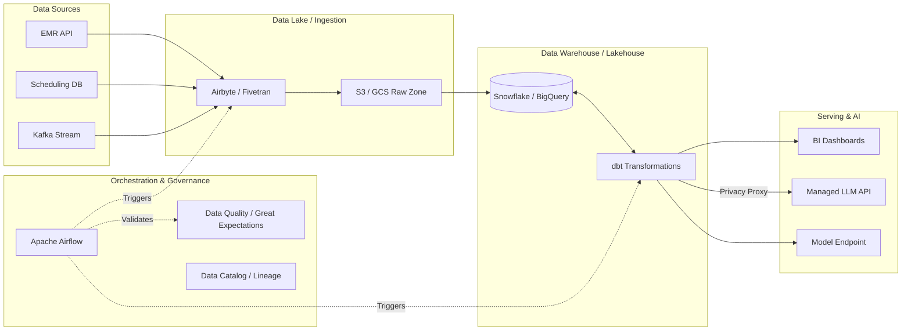

# Healthcare Appointment Mart

## 1. Project Overview

This project takes synthetic healthcare appointment data — nothing real, nothing sensitive — and turns it into something you can actually learn from. It models patients, clinics, appointments and no-shows, runs everything through a layered ETL pipeline, and finishes with two outputs: operational metrics you can query with SQL, and a plain-English AI summary of where the no-show problems are. At no point does raw personal data reach the AI.

## 2. Problem Statement

The assignment (DAI-019) asked for this:

> "Using synthetic, non-sensitive data, model patients, appointments, clinics and no-shows. Build operational metrics and an AI summary of no-show patterns without exposing raw personal fields."

## 3. Key Objectives

What this project set out to do:

- **Healthcare data modeling** — build a realistic (but fully synthetic) appointment ecosystem.
- **ETL pipeline** — extract, validate, stage, transform and load the data.
- **Early validation** — catch bad records at the door instead of deep inside the pipeline.
- **Operational analytics** — use a Star Schema so the important metrics are fast and easy to query.
- **Privacy-safe AI summaries** — hand the AI nothing but aggregated numbers, then let it write the summary.
- **Reproducible runs** — same input, same output, every single time.

## 4. Architecture

The pipeline processes synthetic data through multiple isolated layers to ensure data quality, referential integrity, and privacy.


For the extended system design, see `docs/architecture.md`.

## 5. Technology Stack

A short list, and why each piece is here:

- **Python** — the main language for the pipeline and data generation
- **Pandas** — validation, transformations, metrics prep
- **PostgreSQL** — where the data actually lives
- **SQLAlchemy / psycopg2** — the glue between Python and PostgreSQL
- **Faker** — generates the fake patients, clinics and appointments
- **Pytest** — runs the test suite
- **Docker** — gives you a local PostgreSQL with no manual install
- **Ollama + Qwen3:1.7B** *(optional)* — a free, local AI backend
- **Git / GitHub** — version control
- **Mermaid** — draws the diagrams in these docs

## 6. Data Model

### Core model
- `patients`
- `clinics`
- `appointment_types`
- `appointments`

### Analytical model
- `fact_appointment`
- `dim_patient`
- `dim_clinic`
- `dim_date`
- `dim_appointment_type`

**Fact grain**: "One row represents one scheduled appointment."

**Normalization**: The Core model is normalized to 3NF, establishing primary and foreign keys for referential integrity.
**Star Schema**: The Analytical model is denormalized into a Star Schema. The rationale is to simplify querying, speed up aggregations, and provide a business-friendly structure for reporting.

## 7. ETL Pipeline

Extract → Validate → Stage → Transform → Load Core → Load Mart

- **Validation** — Pandas-based rules check required fields, duplicates, foreign keys, status values and dates. Every problem found is written to a `validation_errors` column.
- **Rejected records** — invalid rows are quarantined during extraction so the good rows can keep moving. One bad file never kills the whole run.
- **Transformations** — derived fields like `no_show_flag`, `time_slot` and age buckets get calculated here.
- **Privacy stripping** — direct personal identifiers are dropped before the analytics layer ever sees them.

## 8. Data Quality

Major validation rules enforced:
- Duplicate appointment detection
- Foreign-key validation
- Status validation
- Date and time validation
- Required fields
- Invalid record quarantine

The failure demonstration handles invalid records gracefully without crashing the entire pipeline.

## 9. Operational Metrics

SQL is the authoritative calculation layer for all metrics, including:
- Total appointments
- Completed
- Cancelled
- No-shows
- No-show rate
- Clinic-level, weekday-level, time-slot-level, and appointment-type-level distributions
- Monthly trends

## 10. AI Architecture

The key idea: **the AI never calculates anything.**

**SQL/Python computes the authoritative metrics.**
Python precomputes:
- highest clinic
- highest weekday
- highest time slot
- highest appointment type
- highest month
- lowest month

The AI's only job is to drop those precomputed facts into a strict 4-section Markdown template:

1. Executive Summary
2. Key Observed Patterns
3. Operational Observation
4. Limitation

**Architecture:**
Metrics → key_findings → privacy validation → AISummarizer → Mock / Ollama → summary

## 11. AI Faithfulness / Hallucination Control

Honest note: the first version got this wrong. We sent the LLM large arrays and asked it to find the rankings, and it attached numbers to the wrong categories.

So we moved every ranking and calculation into deterministic SQL/Python. The LLM now receives only two things:

- `overall`
- `key_findings`

The detailed monthly and category arrays stay in the analytics artifact — they are never sent to the model.

What keeps it honest:

- `temperature=0`
- limited output length
- strict prompt forbidding calculation
- no causal claims allowed
- no invented values allowed

In testing, the summaries matched the numbers we gave them — nothing invented, nothing rearranged.

## 12. Privacy

The raw synthetic input does include fake personal fields — on purpose, so we can demonstrate that they actually get removed:

- `first_name`, `last_name`, `phone`, `email`, `address` are stripped before the data reaches the Core layer.
- Analytical fields like `patient_id`, `date_of_birth` and `zip_code` stay in the database for joins and demographic breakdowns, but they never go to the AI.
- The AI sees aggregated metrics only — never patient-level rows.

Before any API call goes out, a privacy validator scans the payload. These fields are explicitly forbidden: `first_name`, `last_name`, `phone`, `email`, `address`, `date_of_birth`, `patient_id`. If even one shows up, the validator raises an error and the call never happens.

## 13. Testing

The project ships with 48 tests, and they all pass. They cover:

- ETL transformations
- Validation rules
- Analytics / metrics structure
- The privacy boundary
- The AI interface contract
- AI faithfulness (no invented numbers)
- Prompt integration
- Edge cases and failure handling

Run them with:

```bash
pytest -v
```

## 14. Failure / Edge Case Demonstration

We keep a deliberately broken file: `tests/fixtures/invalid_appointments.csv`.

Input → Validation → rejection/quarantine → valid records preserved

You will see the rejected appointments in the log with clear error messages while the healthy records keep moving through. Bad data gets handled; nothing crashes.

## 15. Idempotency / Reproducibility

The current pipeline uses truncate-and-reload for deterministic reproducibility.
This approach is simple and deterministic, making it suitable for this assessment, but is not intended as a full incremental production ingestion strategy.

## 16. Project Structure

```
Healthcare-Appointment-Mart/
├── README.md                     # Problem, architecture, setup, and execution guide
├── requirements.txt              # Pinned Python dependencies
├── pytest.ini                    # Pytest configuration
├── Dockerfile                    # PostgreSQL container image
├── docker-compose.yml            # Local PostgreSQL service
├── .env.example                  # Environment variable template (no secrets committed)
├── .gitignore                    # Ignores .env, venv/, and generated data
│
├── data/
│   ├── sample/                   # Committed synthetic sample CSVs (reference for reviewers)
│   ├── raw/                      # Generated runtime CSVs (git-ignored)
│   ├── processed/                # metrics_payload.json, analytics_report.md (git-ignored)
│   └── rejected/                 # Quarantined invalid records (git-ignored)
│
├── docs/
│   ├── architecture.md           # Extended system architecture
│   ├── design_decision.md        # 1-page design/decision note
│   ├── assessment_compliance.md  # Requirement-to-evidence matrix
│   ├── demo_script.md            # 5–8 minute demo video script
│   └── demo_checklist.md         # Pre-submission checklist
│
├── scripts/
│   └── init_db.sh                # Database initialization helper
│
├── sql/
│   ├── 00_schemas.sql            # Schema creation
│   ├── 01_staging/               # Staging table DDL
│   ├── 02_core/                  # Normalized 3NF core DDL
│   ├── 03_mart/                  # Star schema dims/fact + date population
│   └── 04_analytics/             # Metric views (authoritative calculation layer)
│
├── src/
│   ├── ai/                       # AISummarizer interface, factory, mock/Ollama/Gemini backends,
│   │                             # privacy validator, prompts
│   ├── analytics/                # Metrics aggregation and report builder
│   ├── config/                   # Env-driven settings and logging
│   ├── data_generation/          # Synthetic data generator (Faker)
│   ├── etl/                      # extract -> validate -> transform -> load -> pipeline
│   └── validation/               # Pandas validation rules (quarantine logic)
│
└── tests/
    ├── fixtures/                 # invalid_appointments.csv (failure/edge-case demo)
    └── test_*.py                 # 48 tests: ETL, validation, analytics, privacy, AI faithfulness
```

## 17. Assumptions

Where the assignment left things open, we made these calls and wrote them down:

- **Static, batch-loaded data** — the dataset is generated once and reloaded in full on every run. Incremental/CDC loading is out of scope here; it is listed as a production improvement in section 22.
- **Controlled appointment statuses** — `status` is one of `Scheduled`, `Completed`, `Cancelled` or `No-Show`, and `no_show_flag` is derived straight from `No-Show`.
- **Fixed fact grain** — one row in `fact_appointment` is exactly one scheduled appointment.
- **Deterministic data generation** — generation is seeded (`DATA_SEED=42`), so every re-run produces the same dataset.
- **Local tooling available** — you need Git, Python 3.10+ and Docker Desktop for PostgreSQL. The default `AI_BACKEND=mock` needs no network and no API keys; Ollama and Gemini are optional extras.
- **No real PHI** — all data is synthetic. The privacy pipeline demonstrates defensive design; it is not a certified HIPAA/GDPR control.

## 18. Complete Setup & Execution Guide

Follow these steps and you will go from a fresh clone to a full pipeline run.

### Prerequisites:

- **Git**
- **Docker Desktop** (must be running — it provides PostgreSQL)
- **Python 3.10+**

### Step 1: Clone the Repository

```bash
git clone https://github.com/RavikantBedi/Healthcare-Appointment-Mart.git
cd Healthcare-Appointment-Mart
```

### Step 2: Set up Virtual Environment & Dependencies

Windows (PowerShell):

```powershell
python -m venv venv
.\venv\Scripts\Activate.ps1
pip install -r requirements.txt
```

Mac/Linux:

```bash
python3 -m venv venv
source venv/bin/activate
pip install -r requirements.txt
```

### Step 3: Configure Environment Variables

Copy the template to create your real `.env` file:

```bash
cp .env.example .env
```

You don't need to change anything in `.env` for the default mock run.

### Step 4: Start the PostgreSQL Database

Open Docker Desktop first, then run:

```bash
docker compose up -d
```

Give the container a few seconds to initialize.

### Step 5: Generate Synthetic Data

The full 20,000-row dataset is not committed to Git — you generate it yourself. A small sample dataset sits in `data/sample/` if you just want to see the shape of the data. Your generated files go into `data/raw/` (Git ignores that folder).

```bash
python -m src.data_generation.generate_data
```

> **Important:** always run Python scripts from the project root using `-m` (module mode). That is what makes the `src` package resolve correctly.

### Step 6: Run the ETL Pipeline & AI Summary

To run the full end-to-end pipeline (Extract → Validate → Staging → Core → Mart → Analytics → Mock AI):

Windows (PowerShell):

```powershell
$env:AI_BACKEND="mock"
python -m src.etl.pipeline
```

Mac/Linux:

```bash
AI_BACKEND=mock python -m src.etl.pipeline
```

**Optional — run with real local AI.** If you have Ollama installed and the `qwen3:1.7b` model pulled, use this instead:

```powershell
# Windows
$env:AI_BACKEND="ollama"
$env:OLLAMA_MODEL="qwen3:1.7b"
python -m src.etl.pipeline
```

## 19. Expected Output

When everything works, you should see:

- Row counts reconciled successfully (20,000 appointments)
- Metrics payload generated successfully. Privacy boundary verified.
- 4-Section AI NO-SHOW SUMMARY (Executive Summary, Key Observed Patterns, Operational Observation, Limitation)

## 20. Configuration

Config is loaded with `python-dotenv` and `os.getenv`, then passed around as standard Python `dataclasses`.

- `.env.example` acts as a template.
- `.env` is ignored by Git.
- No secrets are committed to the repository.

## 21. Limitations

Keeping this honest on purpose:

- The data is synthetic — it looks real, but it is not.
- It is a fixed dataset, so every re-run produces identical results.
- Patterns in the data are associations, not causes — a high no-show rate on Mondays does not prove Mondays cause no-shows.
- The pipeline reloads everything each run (no incremental loading).
- Local LLM output quality depends on the model you run.
- This is an assessment-sized platform, not a clinical production system.

## 22. Future Improvements (Target Production Architecture)

For migrating this assessment-scale pipeline to an enterprise production environment, the following architectural enhancements would be recommended:



**Key Enhancements:**
- **Incremental loading:** Transition from truncate-and-reload to CDC (Change Data Capture) / upserts for continuous integration.
- **Orchestration:** Deploy Apache Airflow or Dagster to manage complex pipeline dependencies and alerting.
- **Dashboarding:** Expose Star Schema metrics directly via modern BI tools (e.g., Superset, Tableau, Metabase).
- **Monitoring & Lineage:** Implement Great Expectations for data testing in flight and DataHub for tracking column-level lineage.
- **Model Evaluation:** Systematize LLM output evaluation (e.g., RAGAS) to continually audit AI faithfulness in production.
- **Cloud Deployment:** Containerize and deploy via Kubernetes, leveraging managed data warehouse infrastructure.