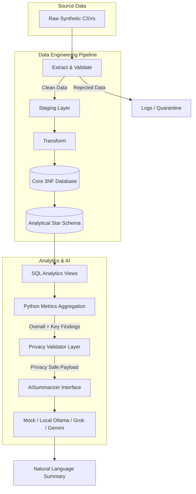
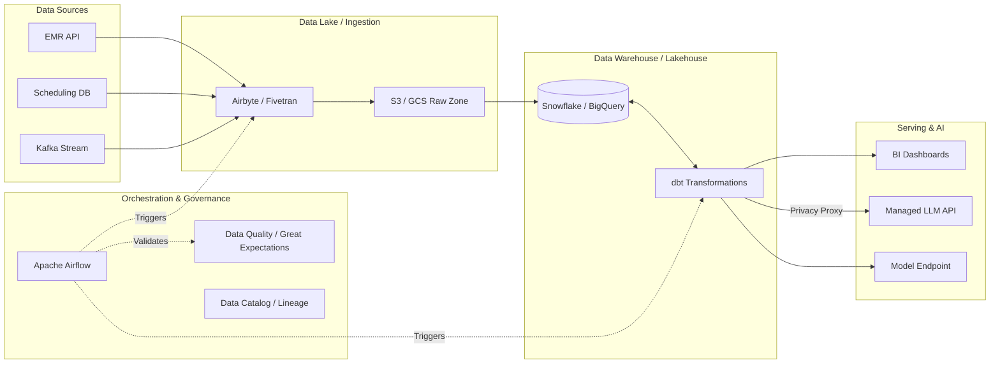

# Healthcare Appointment Mart

## 1. Project Overview

This project models healthcare appointments using synthetic, non-sensitive data and analyzes no-show patterns using a layered data engineering architecture. It also generates a privacy-safe AI summary of precomputed operational metrics.

## 2. Problem Statement

"Using synthetic, non-sensitive data, model patients, appointments, clinics and no-shows. Build operational metrics and an AI summary of no-show patterns without exposing raw personal fields."

## 3. Key Objectives

- **Healthcare data modeling**: Simulates a realistic healthcare appointment ecosystem.
- **ETL**: Extracts, validates, stages, transforms, and loads data.
- **Data validation**: Validates rules and data types early in the pipeline.
- **Operational analytics**: Utilizes a Star Schema to compute high-value metrics.
- **Privacy-safe AI summarization**: Safely injects deterministic metrics into an AI model for natural language summaries.
- **Reproducible execution**: Ensures consistent, idempotent pipeline runs.

## 4. Architecture

The pipeline processes synthetic data through multiple isolated layers to ensure data quality, referential integrity, and privacy.



(See `docs/architecture.md` for extended system design details).

## 5. Technology Stack

- Python
- Pandas
- PostgreSQL
- SQLAlchemy / psycopg2
- Faker
- Pytest
- Docker
- Ollama (Optional)
- Qwen3:1.7B (Optional)
- Git/GitHub
- Mermaid for architecture documentation

## 6. Data Model

### Core model
- `patients`
- `clinics`
- `appointment_types`
- `appointments`

### Analytical model
- `fact_appointment`
- `dim_patient`
- `dim_clinic`
- `dim_date`
- `dim_appointment_type`

**Fact grain**: "One row represents one scheduled appointment."

**Normalization**: The Core model is normalized to 3NF, establishing primary and foreign keys for referential integrity.
**Star Schema**: The Analytical model is denormalized into a Star Schema. The rationale is to simplify querying, speed up aggregations, and provide a business-friendly structure for reporting.

## 7. ETL Pipeline

Extract → Validate → Stage → Transform → Load Core → Load Mart

- **Data validation**: Validates inputs using Pydantic models.
- **Rejected records**: Isolates invalid records during extraction so valid records can continue.
- **Transformations**: Derives fields such as `no_show_flag` and `time_slot`.
- **Privacy stripping**: Ensures protected personal fields do not flow into the analytics output layer.

## 8. Data Quality

Major validation rules enforced:
- Duplicate appointment detection
- Foreign-key validation
- Status validation
- Date validation
- Required fields
- Invalid record quarantine

The failure demonstration handles invalid records gracefully without crashing the entire pipeline.

## 9. Operational Metrics

SQL is the authoritative calculation layer for all metrics, including:
- Total appointments
- Completed
- Cancelled
- No-shows
- No-show rate
- Clinic-level, weekday-level, time-slot-level, and appointment-type-level distributions
- Monthly trends

## 10. AI Architecture

**SQL/Python computes the authoritative metrics.**
Python precomputes:
- highest clinic
- highest weekday
- highest time slot
- highest appointment type
- highest month
- lowest month

**The AI is NOT used to calculate or rank metrics.**
AI is ONLY used to convert precomputed findings into a human-readable summary.

**Architecture:**
Metrics → key_findings → privacy validation → AISummarizer → Mock / Ollama → summary

## 11. AI Faithfulness / Hallucination Control

Initially, the LLM received large detailed arrays and was asked to derive rankings, which caused incorrect numerical associations. 
The final architecture moved ranking/calculation into deterministic SQL/Python logic.

The LLM now receives only:
- `overall`
- `key_findings`

The detailed monthly and category arrays remain in the analytics artifact but are NOT transmitted to the LLM. 

Control measures:
- `temperature=0`
- limited output length
- strict prompt forbidding calculation
- no causal claims allowed
- no invented values allowed

The tested outputs were fully consistent with the supplied metrics.

## 12. Privacy

Raw synthetic input may include synthetic personal fields for demonstrating the privacy boundary. However:
- Core does not retain raw personal fields.
- Mart does not retain raw personal fields.
- Analytics payload does not contain raw personal fields.
- AI payload does not contain patient-level personal fields.

Protected fields: `first_name`, `last_name`, `phone`, `email`, `address`, `date_of_birth`, `patient_id`.
An active privacy validator strictly enforces this before API calls.

## 13. Testing

The project has 26 passing tests across these categories:
- ETL
- validation
- analytics
- privacy
- AI interface
- AI faithfulness
- edge cases
- failure handling

Run tests with:
`pytest -v`

## 14. Failure / Edge Case Demonstration

An intentional invalid fixture demonstrates edge cases.
Input → Validation → rejection/quarantine → valid records preserved

Example error log entry will show rejected appointments while the successful records flow through.

## 15. Idempotency / Reproducibility

The current pipeline uses truncate-and-reload for deterministic reproducibility.
This approach is simple and deterministic, making it suitable for this assessment, but is not intended as a full incremental production ingestion strategy.

## 16. Setup

Prerequisites:
- Git
- Docker Desktop
- Python 3.10+
- Ollama (only if local AI is enabled)

## 17. Run the Project

### Default/mock execution
```powershell
$env:AI_BACKEND="mock"
python -m src.etl.pipeline
```

### Local Ollama execution
```powershell
$env:AI_BACKEND="ollama"
$env:OLLAMA_MODEL="qwen3:1.7b"
python -m src.etl.pipeline
```

## 18. Expected Output

- Row counts reconciled successfully (20,000 appointments)
- Metrics payload generated successfully. Privacy boundary verified.
- AI NO-SHOW SUMMARY

## 19. Configuration

- `.env.example` acts as a template.
- `.env` is ignored by Git.
- No secrets are committed to the repository.

## 20. Limitations

- Data is synthetic.
- Deterministic dataset.
- Observed associations do not establish causes.
- Truncate-and-reload strategy.
- Local LLM output quality depends on the model capabilities.
- The project is an assessment-sized data platform, not a clinical production system.

## 21. Future Improvements (Target Production Architecture)

For migrating this assessment-scale pipeline to an enterprise production environment, the following architectural enhancements would be recommended:



**Key Enhancements:**
- **Incremental loading:** Transition from truncate-and-reload to CDC (Change Data Capture) / upserts for continuous integration.
- **Orchestration:** Deploy Apache Airflow or Dagster to manage complex pipeline dependencies and alerting.
- **Dashboarding:** Expose Star Schema metrics directly via modern BI tools (e.g., Superset, Tableau, Metabase).
- **Monitoring & Lineage:** Implement Great Expectations for data testing in flight and DataHub for tracking column-level lineage.
- **Model Evaluation:** Systematize LLM output evaluation (e.g., RAGAS) to continually audit AI faithfulness in production.
- **Cloud Deployment:** Containerize and deploy via Kubernetes, leveraging managed data warehouse infrastructure.
