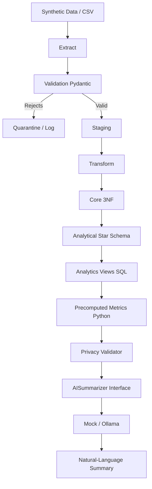

# System Architecture

## 1. Architecture Overview
The Healthcare Appointment Mart is a layered data pipeline built to process, validate, and analyze healthcare appointments while maintaining a strict privacy boundary for AI summarization.

## 2. Data Flow
Synthetic Data → Raw CSV → Extract → Validation → Staging → Transform → Core 3NF → Analytical Star Schema → Analytics Views → Precomputed Metrics + key_findings → Privacy Validator → AISummarizer Interface → Mock / Ollama / Optional Cloud Provider → Natural-Language Summary

## 3. Raw Layer
Contains synthetic CSV files simulating exports from external operational systems (`patients.csv`, `clinics.csv`, `appointment_types.csv`, `appointments.csv`).

## 4. Staging Layer
The staging layer (`staging_` tables) ingests raw data precisely as it is received after passing initial Pydantic validation. It provides a clean, 1:1 replica of the validated raw files within PostgreSQL.

## 5. Core 3NF
The core layer normalizes the data into Third Normal Form (3NF). It enforces referential integrity between appointments, patients, clinics, and types, stripping away noise and redundant records.

## 6. Analytical Mart
A denormalized Star Schema built for fast analytics.
- **Fact Table:** `fact_appointment` (grain: 1 row = 1 appointment)
- **Dimension Tables:** `dim_patient`, `dim_clinic`, `dim_date`, `dim_appointment_type`

## 7. Analytics Views
SQL views layered over the Star Schema calculate deterministic metrics such as total counts, no-show rates by clinic, weekday, time slot, and monthly trends.

## 8. Privacy Boundary
Before leaving the core analytical area, metrics are validated to ensure absolutely zero Personal Identifiable Information (PII) flows to external consumers or AI APIs. 

## 9. AI Interface
An interface (`AISummarizer`) abstracts the underlying AI backend, enabling seamless swapping between different AI providers without changing the core business logic.

## 10. Mock/Ollama Flow
- **Mock:** Returns a deterministic summary using string interpolation. Completely offline.
- **Ollama:** Calls a locally running instance of Ollama (Qwen3:1.7B) using a strict system prompt and heavily filtered metrics payload (`overall` + `key_findings`).

## 11. Failure Handling
Corrupt, malformed, or invalid rows are rejected at the Pydantic validation stage and quarantined in memory/logs while valid rows proceed successfully. The pipeline does not crash due to isolated data anomalies.

## 12. Configuration
Configuration is injected via `.env` files parsed by Pydantic `BaseSettings`. It controls the database URL, selected AI backend, thresholds, and endpoints.

## 13. Docker
PostgreSQL runs via `docker-compose.yaml`. This ensures a standardized, isolated, and reproducible database environment.

## 14. Testing
Tests are orchestrated via Pytest. They validate ETL idempotency, data rules, privacy boundary constraints, AI output faithfulness, and mock behavior.

## 15. Architecture Diagram

