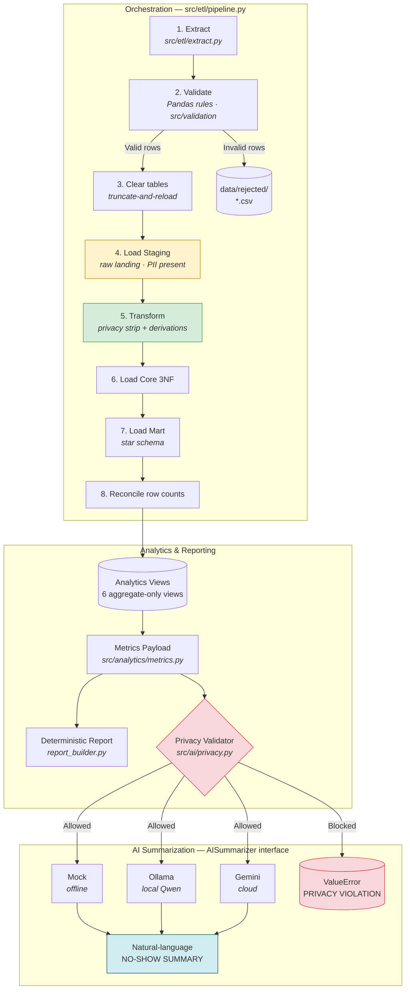
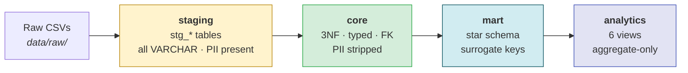
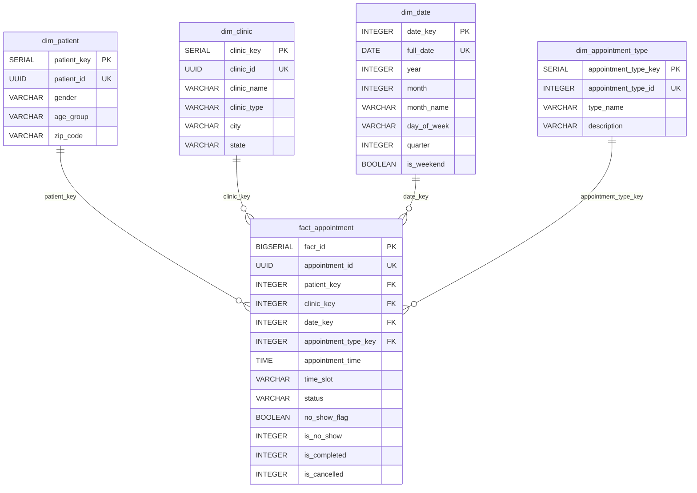
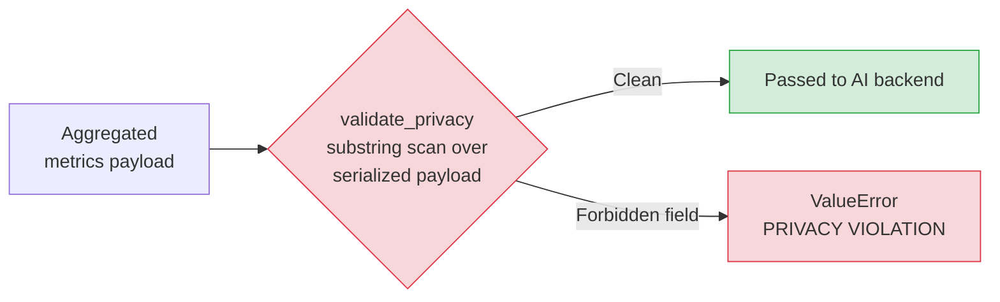
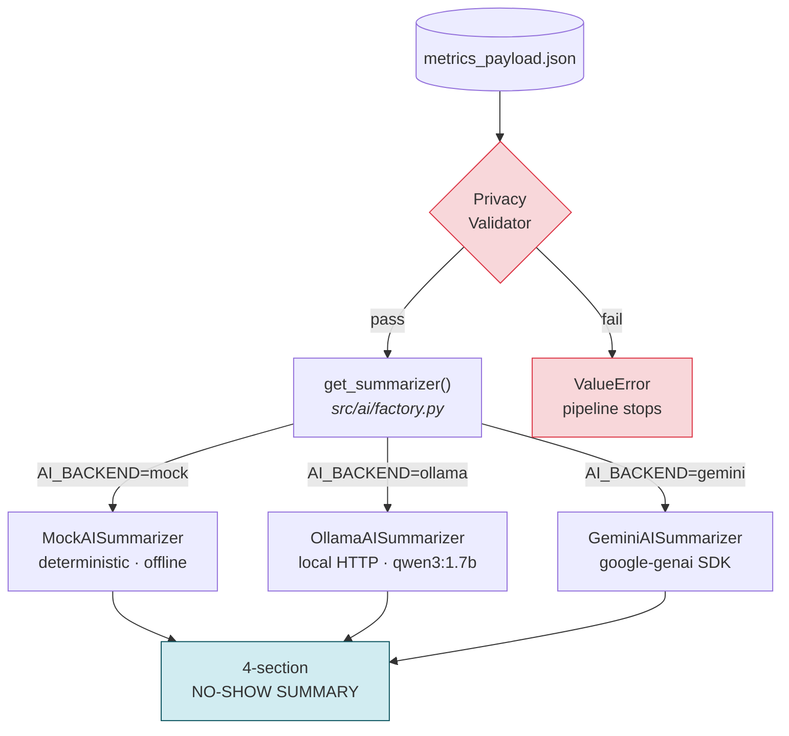
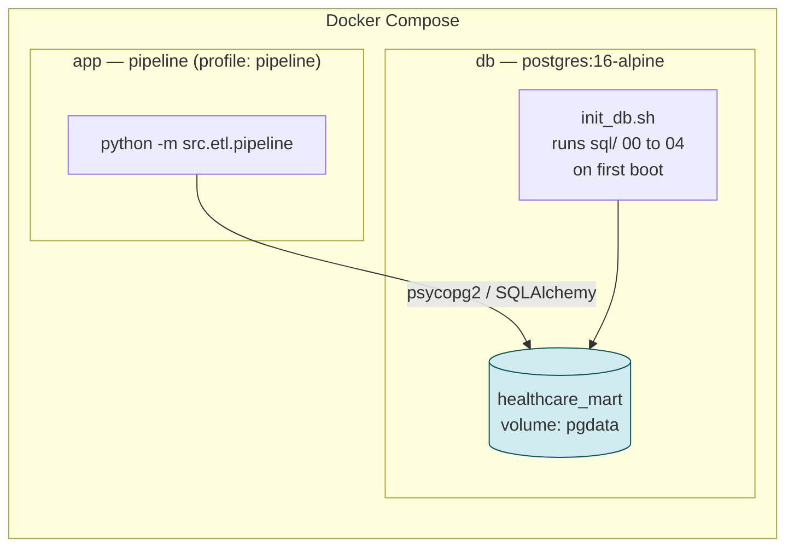
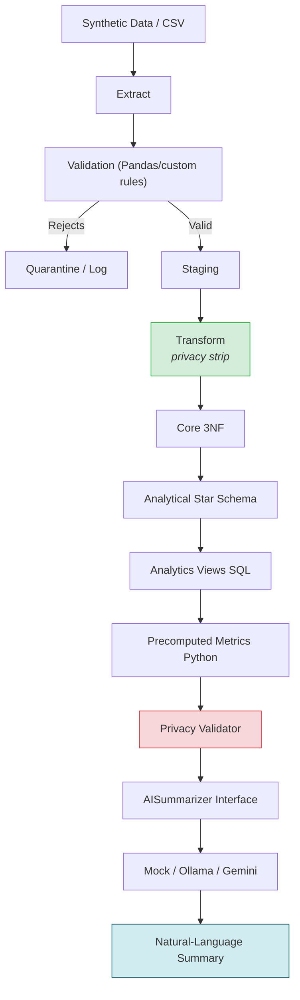

# System Architecture

## 1. Architecture Overview

The Healthcare Appointment Mart is a **layered data platform** that ingests synthetic healthcare
appointment records, validates them, and loads them through three isolated data layers before
producing deterministic operational metrics and a privacy-safe AI summary.

Two invariants govern the entire design:

| Invariant | How it is enforced |
| :--- | :--- |
| **Privacy** — no direct personal identifier ever reaches the analytics layer or an AI backend | Stripped during transform with assertions, absent from Core/Mart DDL, and blocked by a payload validator |
| **Faithfulness** — the LLM never computes or invents values | All math happens in SQL/Python; the model only verbalizes precomputed `key_findings` |

**Stack:** Python 3.10+ · Pandas · PostgreSQL 16 · SQLAlchemy · psycopg2 · Faker · pytest · Docker · Ollama/Gemini (optional)

## 2. End-to-End Data Flow



## 3. Data Layers

PostgreSQL hosts **four schemas**, each with a single responsibility. Data only moves forward.



| Layer | Schema | Purpose | PII |
| :--- | :--- | :--- | :--- |
| Staging | `staging` | Faithful 1:1 landing copy of validated raw data | **Present** |
| Core | `core` | Normalized 3NF model with full constraints | **Absent** |
| Mart | `mart` | Denormalized star schema optimized for aggregation | **Absent** |
| Analytics | `analytics` | Reusable aggregate-only views feeding metrics | **Absent** |

> The **privacy boundary** sits between Staging and Core. Personal fields exist in `staging` for
> traceability only and are never selected by any query that feeds metrics or AI.

### 3.1 Raw Layer

Synthetic CSVs generated by `src/data_generation/generate_data.py` (Faker, seed `42`) into `data/raw/`:

`patients.csv` · `clinics.csv` · `appointment_types.csv` · `appointments.csv`

A small committed sample lives in `data/sample/` for reference; the full 20,000-row runtime dataset
is Git-ignored. All columns are read as strings so malformed values reach validation instead of
being silently coerced.

### 3.2 Validation Stage (`src/validation/validators.py`)

Validation is **Pandas-based**, not schema-library based. Each rule appends a human-readable message
to a `validation_errors` column; any row with at least one message is quarantined.

| Rule | Applies to |
| :--- | :--- |
| Required fields present | All entities |
| Primary-key uniqueness | All entities |
| Controlled vocabulary (`gender`, `status`) | Patients, Appointments |
| Date/time format and range (2023-01-01 → 2026-12-31) | Appointments |
| Foreign keys (`patient_id`, `clinic_id`, `appointment_type_id`) | Appointments |

Rejected rows are written to `data/rejected/*.csv` with their error reasons, while valid rows
continue. The pipeline never crashes on isolated anomalies.

### 3.3 Staging Layer

Four `stg_*` tables mirror the raw files. Every column is `VARCHAR` with only a primary key — no
foreign keys or `CHECK` constraints — so raw data lands exactly as received.

### 3.4 Transform Stage (`src/etl/transform.py`)

The privacy boundary is enforced here. The five direct identifiers
(`first_name`, `last_name`, `phone`, `email`, `address`) are dropped, then each column is
asserted absent — a leaked field raises immediately.

Derivations applied:

- `age_group` → `0-17`, `18-30`, `31-45`, `46-60`, `61+`
- `no_show_flag` → `status == 'No-Show'`
- `time_slot` → `Early Morning` (<10h), `Late Morning` (10–12h), `Afternoon` (12–15h), `Mid Afternoon` (15–17h), `Evening` (≥17h)
- Data types cast to `DATE`, `TIME`, `TIMESTAMP`

### 3.5 Core 3NF

Fully typed and constrained, with **no personal name/contact columns by design**:

- `core.patients` — `UUID` PK, `CHECK` on gender and age group
- `core.clinics` — `UUID` PK, unique clinic name
- `core.appointment_types` — `INTEGER` PK, unique type name
- `core.appointments` — `UUID` PK, **three foreign keys**, status `CHECK`, date-range `CHECK`, plus five supporting indexes

### 3.6 Analytical Mart (Star Schema)

**Fact grain:** one row = one scheduled appointment, regardless of final status.



Design notes:

- **Surrogate keys** (`SERIAL`) decouple the mart from source system IDs; natural keys are retained for traceability.
- **Additive measures** `is_no_show` / `is_completed` / `is_cancelled` are `INTEGER` 0/1 so views can `SUM()` directly.
- **`dim_date`** is pre-populated (`populate_dim_date.sql`) and intentionally **excluded** from truncate-and-reload.
- The fact row is built in SQL by joining Core to every dimension, so an unmatched dimension drops the row rather than producing a null key.

### 3.7 Analytics Views

Six views in `analytics`, all aggregate-only with no patient-level output:

| View | Question answered |
| :--- | :--- |
| `vw_overall_metrics` | Status distribution and overall no-show rate |
| `vw_clinic_no_show_rate` | Which clinics show the highest rates |
| `vw_weekday_no_show_rate` | Which days of week show the highest rates |
| `vw_time_slot_no_show_rate` | Which parts of the day show the highest rates |
| `vw_appointment_type_no_show_rate` | Which visit types show the highest rates |
| `vw_monthly_no_show_trend` | How rates move month over month |

## 4. Privacy Boundary



Defence in depth — four independent layers must all hold:

1. **Transform** — columns dropped, then asserted absent.
2. **Schema** — Core, Mart, and the views have no personal columns to select.
3. **Metrics payload** — serializes the payload and asserts `patient_id` / `first_name` never appear.
4. **AI entry point** — `validate_privacy()` scans for every forbidden field before any request:

   `patient_id` · `first_name` · `last_name` · `patient_name` · `phone` · `email` · `address` · `date_of_birth` · `appointment_id`

## 5. Metrics & Reporting

`src/analytics/metrics.py` queries the views and **precomputes every value the reader will see**:

- Status counts and percentages (`completed_pct`, `no_show_pct`, …)
- Highest/lowest clinic, weekday, time slot, appointment type, and month
- `difference_from_overall_pp` for each key finding (percentage-point deltas)
- Highest-to-lowest month spread

Two outputs are produced:

- **`data/processed/metrics_payload.json`** — the structured payload
- **`data/processed/analytics_report.md`** — a deterministic 7-section markdown report from `report_builder.py`, built entirely with string interpolation and **no LLM**

A clinic minimum-sample threshold (`CLINIC_MIN_SAMPLE`, default 50) keeps small-volume clinics from
dominating the rankings.

## 6. AI Interface



All backends implement the single `AISummarizer` abstract interface (`src/ai/interface.py`), so
swapping providers requires no change to pipeline logic.

**Payload minimization:** only `overall` and `key_findings` are ever sent to a model —
`monthly_trend` and `detailed_data` are deliberately withheld to keep the prompt small and prevent
misinterpretation.

**Hallucination control** (`src/ai/prompts.py`):

- The model is forbidden from calculating, ranking, comparing, or deriving anything.
- Dimension-isolation rules prevent cross-dimension claims (e.g. a clinic and a weekday finding may never be combined).
- A fixed 4-section Markdown template constrains the output shape.
- Ollama runs with `temperature: 0.0`, `think: false`, `num_predict: 300`.

**Failure handling:** if a backend is unreachable, the summarizer raises `RuntimeError`; the
pipeline logs a warning and finishes — metrics are still produced successfully.


## 7. Idempotency & Reconciliation

**Strategy: truncate-and-reload** (`clear_database()`), executed in reverse dependency order before
each load. `mart.dim_date` is preserved because it is a static calendar dimension.

After loading, the pipeline reconciles row counts across every layer:

```
raw extract = validated = staging = core = mart fact
```

Any mismatch logs `ROW COUNT MISMATCH DETECTED!`; equality logs `Row counts reconciled successfully.`

This is deterministic and duplicate-free by construction — ideal for a snapshot dataset (see
`docs/design_decision.md`, Decision 9). Production systems would replace it with CDC/upserts.

## 8. Configuration

Configuration is loaded from `.env` using **python-dotenv**, **`os.getenv`**, and **dataclass-based
settings** (`src/config/settings.py`) — a frozen `Settings` singleton with no hardcoded secrets.

| Group | Controls |
| :--- | :--- |
| `DatabaseSettings` | PostgreSQL user, password, host, port, database |
| `AISettings` | `AI_BACKEND`, Ollama URL/model, Gemini key/model |
| `AnalyticsSettings` | Clinic minimum sample threshold |
| `DataGenerationSettings` | Seed and row counts for synthetic data |
| `PathSettings` | Resolved project directories |

`.env.example` is the committed template; `.env` is Git-ignored.

## 9. Deployment



- **`db`** starts PostgreSQL 16-alpine, mounts `./sql`, and runs `scripts/init_db.sh` via
  `docker-entrypoint-initdb.d`, creating all four schemas, tables, indexes, `dim_date`, and views in
  dependency order. A `pg_isready` healthcheck gates readiness.
- **`app`** builds from the `Dockerfile` (Python 3.11-slim + `postgresql-client`), sits behind the
  `pipeline` profile so it runs on demand, sets `POSTGRES_HOST=db`, and shares `./data` with the host.

Local (non-Docker) execution runs identically from the project root using module mode:
`python -m src.etl.pipeline`.

## 10. Observability & Failure Handling

Structured logging (`src/config/logging_config.py`) emits a consistent format to stdout:

```
2026-10-08 09:15:04 | INFO     | src.etl.pipeline              | STARTING PIPELINE RUN
```

- **Data failures** — malformed rows are quarantined to `data/rejected/` with explicit reasons; valid rows proceed.
- **Schema failures** — missing files or missing columns raise during extraction and stop the run.
- **AI failures** — `RuntimeError` is caught and downgraded to a warning so the metrics pipeline still succeeds.
- **Fatal failures** — the orchestrator logs the traceback and exits with a non-zero status.

## 11. Testing

Tests run via **pytest** (`pytest.ini`, 48 tests) and cover:

| Area | What is proven |
| :--- | :--- |
| ETL | Extraction schema checks, transform derivations, load idempotency |
| Validation | Rule enforcement and quarantine of an invalid fixture |
| Analytics | Metrics payload shape and precomputed percentages |
| Privacy | Every forbidden field triggers a violation, including nested payloads |
| AI faithfulness | Exact values used, no invented months/rankings/causal language |
| Prompt integration | Payload sent to the LLM contains only `overall` + `key_findings` |
| Edge cases | Zero-denominator payloads, clinic minimum-sample threshold, backend fallback |

## 12. Technology Map

| Concern | Technology | Where |
| :--- | :--- | :--- |
| Language | Python 3.10+ | `src/` |
| Dataframes | Pandas 2.2 | `src/etl/` |
| Validation | Pandas rule functions | `src/validation/` |
| Database | PostgreSQL 16 | `docker-compose.yml` |
| ORM / driver | SQLAlchemy 2 + psycopg2 | `src/etl/load.py` |
| SQL layer | DDL + analytics views | `sql/` |
| Synthetic data | Faker (seeded) | `src/data_generation/` |
| Configuration | python-dotenv + dataclasses | `src/config/settings.py` |
| AI backends | Ollama (Qwen3:1.7B), Gemini, Mock | `src/ai/` |
| Testing | pytest | `tests/` |
| Containerization | Docker Compose | `Dockerfile`, `docker-compose.yml` |

## 13. Architecture Diagram (single view)



